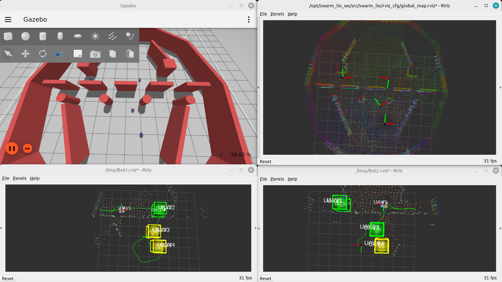
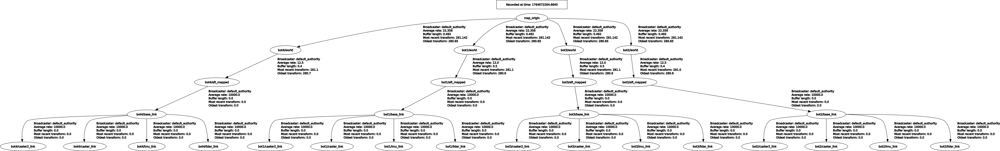

# FishBot MultiRobot Simulator



Multi-robot simulation stack for testing lidar-inertial SLAM, map fusion, and navigation on a swarm of robots. Everything runs in Docker with ROS 2 Humble.

## What’s inside

- Gazebo-based simulator (`src/gazebo_sim`) with parametrised robot blueprints and spawn helpers.
- Swarm-LIO2 ROS 2 port (`src/Swarm-LIO2-ROS2-Docker`) for multi-agent lidar-inertial odometry.
- Map fusion (`src/map_fusion`) that merges per-robot point clouds into `/global_downsampled_map`, creates ESDF, and republishes global poses.
- Foxglove wrapper (`src/foxglove_app`) for multi-agent visualization layouts.
- Navigation controller (`src/navigation`). Not integrated yet.
- Exploration module: ***TODO***

## How the pieces fit together



- **Gazebo** spawns `botN` robots (default `bot1..bot4`) with URDFs built from YAML configs. Each robot publishes odom/IMU/lidar topics into ROS 2 and TF frames for every robot.
- **Swarm-LIO2** reads lidar/IMU per robot for ego and other agents state estimation (see [`src/Swarm-LIO2-ROS2-Docker/README.md`](src/Swarm-LIO2-ROS2-Docker/README.md)). After SLAM initializes it publishes extrinsic transforms between agents.
- **Map fusion** listens to `map_origin -> botN/world` TF, accumulates, and publishes a merged global map plus each agent pose relative to `map_origin`.
- **Foxglove** provides ready layouts for multi-agent visualization.
- **Navigation** *TODO*.
- **Exploration** *TODO*.

### Interfaces for autonomous exploration

- Control input: `/bot*/cmd_vel` (geometry_msgs/Twist) per robot namespace.
- Shared map: `/global_downsampled_map` (sensor_msgs/PointCloud2) fused from all agents.
- Global poses: `/bot*/global_pose` (geometry_msgs/PoseStamped) relative to `map_origin` for localization.
- ESDF: generation/publishing is not finished yet.  <!-- <fill in when ESDF is available> -->

## Repository structure

- `docker/` – Dockerfiles per module, shared entrypoint, and `ros.env` for ROS domain/implementation.
- `docker-compose.yml` – top-level entrypoint to launch containers.
- `src/` – source code for each package:
  - `gazebo_sim/` – Gazebo worlds, robot blueprints, and spawn launch files.
  - `Swarm-LIO2-ROS2-Docker/` – upstream SLAM port (includes its own compose file).
  - `map_fusion/` – map fusion nodes.
  - `navigation/` – navigation package.
  - `foxglove_app/` – Foxglove bridge wrapper, layouts, and optional extension.

## Prerequisites

- **Docker** + **docker compose v2**.
- NVIDIA GPU with drivers + `nvidia-container-toolkit` (Gazebo, Swarm-LIO2, and map fusion use `runtime: nvidia`/`gpus: all`).

## Quick start (everything via Docker)


1. Build images (base + modules):

   ```bash
   docker compose build
   ```

   builds all Docker images for this project.

2. Allow GUI access for Gazebo/RViz (if needed):

   ```bash
   xhost +local:root
   ```

3. Launch the full stack (Gazebo + SLAM + fusion + Foxglove):

   ```bash
   docker compose up gazebo swarm_lio2 map_fusion foxglove
   ```

   - Gazebo: spawns 4 robots on a circle (`bot1..bot4`).
   - Swarm-LIO2: runs its simulation launch file with `bot_list:=1,2,3,4`.
   - Map fusion: outputs `/global_downsampled_map` and `/bot*/global_pose`.
   - Foxglove: launches server on `ws://localhost:8765`.

4. Inspect topics if you want (inside any container):

   ```bash
   docker exec -it fishbot_gazebo bash
   ros2 topic list
   ```

## How to initialize SLAM

Goal: move one agent until all others initialize.
Note: wait about 10 seconds to IMU initialization for SLAM, before moving.

- **Step 1:** enter the Gazebo container shell.

    ```bash
    docker exec -it fishbot_gazebo bash
    ```

- **Step 2:** start keyboard teleop:

    ```bash
    ros2 run teleop_twist_keyboard teleop_twist_keyboard --ros-args --remap cmd_vel:=/bot1/cmd_vel
    ```

- **Step 3:** move the agent around the others until all are detected (green/yellow cluster). Use RViz for easier visualization.

## TODOs

- Create a parametrized launch file to launch simulation with N agents easily.
- Simplify SLAM initialization steps and document best practices.
